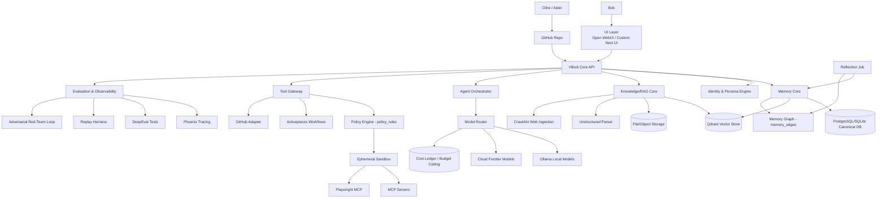
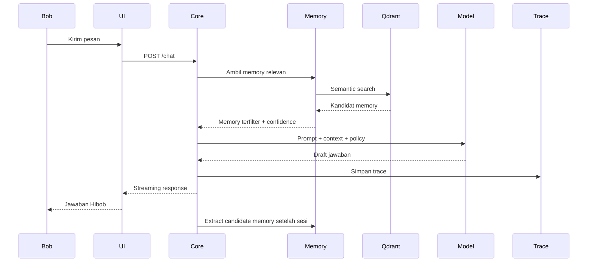
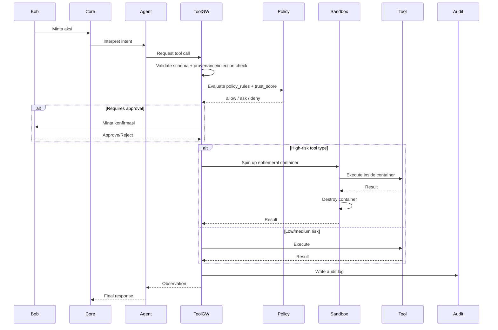

# Hibob System Architecture

Status: Draft matang v0.1

## 1. Prinsip arsitektur

Hibob menggunakan arsitektur **core-and-adapters**:

- Hibob Core menyimpan logika produk.
- Resource eksternal dipasang sebagai adapter.
- UI, model, vector DB, automation, coding agents, dan MCP tools boleh diganti.
- Data canonical tetap milik Hibob.

Tujuannya: saat teknologi AI berubah, Hibob tidak perlu dibongkar dari nol.

## 2. High-level architecture



## 3. Komponen inti

### 3.1 UI Layer

Pilihan awal:

- Open WebUI sebagai cockpit lokal cepat.
- Custom UI masa depan untuk experience Hibob yang lebih personal.

UI tidak boleh menjadi tempat utama memory, policy, atau orchestration. UI hanya permukaan.

### 3.2 Hibob Core API

Hibob Core adalah backend utama. Tanggung jawab:

- conversation management,
- memory lifecycle,
- knowledge ingestion orchestration,
- model routing,
- agent orchestration,
- tool permission,
- audit logging,
- eval hooks,
- blueprint update proposal.

Rekomendasi implementasi:

- Python FastAPI untuk backend utama.
- Modular monolith pada awal.
- Background worker untuk ingestion/eval/tool jobs.

### 3.3 Identity & Persona Engine

Mengatur:

- gaya bicara,
- relationship mode,
- prinsip dialog,
- batas persona,
- mode formal/informal,
- mode skeptic/architect/builder.

Persona tidak boleh hanya prompt panjang. Persona harus didukung memory dan policy.

### 3.4 Memory Core

Fungsi:

- candidate extraction,
- memory approval,
- memory search,
- conflict detection,
- expiry/superseding,
- source linking,
- memory scoring.

Memory Core memakai:

- relational DB untuk canonical records,
- Qdrant untuk vector retrieval,
- optional embeddings local/cloud.

### 3.5 Knowledge/RAG Core

Fungsi:

- ingest dokumen,
- parse dokumen,
- chunking,
- embedding,
- indexing,
- retrieval,
- reranking,
- source citation,
- freshness tracking.

Parser:

- Unstructured untuk PDF/DOCX/HTML kompleks.
- Crawl4AI untuk crawling web menjadi markdown AI-ready.

### 3.6 Model Router

Fungsi:

- memilih model berdasarkan task,
- memisahkan local/private vs cloud/power mode,
- fallback saat model gagal,
- logging biaya, latency, kualitas.

Interface minimal:

```text
generate_text(request) -> response
embed_text(request) -> embeddings
run_agent(request) -> agent_result
judge(request) -> evaluation_result
```

Model router harus mendukung:

- Ollama,
- OpenAI-compatible API,
- provider frontier masa depan,
- local model baru,
- specialized model untuk embedding/reranking.

Dua kapabilitas tambahan (ADR 0008, ADR 0012):

- **Dry-run mode** - router bisa merakit ulang sebuah historical request dan mengeksekusinya terhadap model kandidat tanpa memengaruhi state produksi, dipakai oleh Replay Harness untuk validasi migrasi model.
- **Cost circuit breaker + learned bias** - setiap call cloud didebit ke `cost_ledger` terhadap `budget_ceilings` harian/sesi; ceiling terlampaui memaksa pause + approval request (lokal/Ollama tidak terdampak). Di antara kandidat yang sudah diizinkan tabel routing statis, router boleh bias pilihan memakai bounded epsilon-greedy bandit berdasar riwayat eval/cost/latency (`router_policy_feedback`) - bandit ini tidak pernah memperluas model mana yang eligible, privacy tier dan risk constraint selalu menang.

### 3.7 Agent Orchestrator

Agent orchestrator mengelola loop:

```text
intent -> plan -> retrieve context -> choose model -> call tool if needed -> observe -> respond -> summarize -> update candidates
```

Untuk v0.1, cukup simple orchestrator. OpenAI Agents SDK, Hermes Agent, LangGraph, atau framework lain boleh dievaluasi, tapi Hibob harus tetap punya abstraction sendiri.

### 3.8 Tool Gateway

Semua tool action harus lewat gateway:

1. Validate input schema.
2. Check provenance/injection classifier on any retrieved content involved (ADR 0005).
3. Evaluate via Policy Engine -> allow/ask/deny, considering trust score within risk ceiling (ADR 0005).
4. Ask approval jika perlu.
5. Execute tool - high-risk types (shell/browser/third-party MCP) run inside the ephemeral sandbox (ADR 0011).
6. Capture output.
7. Write audit log.
8. Send trace.

### 3.9 Observability & Evaluation

Phoenix untuk tracing runtime.
DeepEval untuk regression tests.

Trace harus menangkap:

- model calls,
- retrieval,
- tool calls,
- permission decisions,
- prompt versions,
- memory IDs,
- latency,
- error.

### 3.10 Reflection Job (ADR 0010)

Job terjadwal, local-model, read-only. Menyisir memory, session summaries, dan memory graph untuk konflik belum terselesaikan, asumsi belum diuji, dan sumber RAG stale. Tidak punya akses tool execution maupun write durable memory - hanya menulis ke `reflections` dan mengusulkan kandidat lewat pipeline approval yang sama dengan jalur memory candidate biasa.

## 4. Deployment topology v0.1

Local-first via Docker/WSL2:

```text
hibob-core-api
hibob-worker
hibob-reflection-job (ADR 0010, scheduled)
sandbox-runtime (Docker-in-Docker or sibling containers, ADR 0011)
postgres atau sqlite awal
qdrant
ollama
open-webui
phoenix
activepieces optional
```

Minimal local stack:

```text
Docker Compose
Ollama
Qdrant
Hibob Core
Open WebUI/custom UI
Phoenix
```

## 5. Runtime flow: chat dengan memory



## 6. Runtime flow: tool action



## 7. Core boundaries

### Hibob Core owns

- canonical memory,
- memory lifecycle,
- identity rules,
- permission policy,
- audit logs,
- tool definitions,
- blueprint decisions,
- evaluation registry,
- API contracts,
- policy engine decisions and trust scores (ADR 0005),
- memory graph and confidence calibration (ADR 0006, ADR 0007),
- cost ledger and budget ceilings (ADR 0012).

### Tools own

- UI rendering,
- model inference,
- vector search backend,
- parsing implementation,
- browser automation execution,
- workflow execution,
- coding assistant editing.

### Tools must not own

- canonical identity,
- final memory truth,
- global permission policy,
- project direction,
- source of truth for decisions.

## 8. Architecture quality attributes

| Attribute | Design choice |
|---|---|
| Evolvability | Adapter pattern, model router, MCP-ready tool contracts |
| Privacy | local-first mode, privacy tiers, redaction before cloud |
| Safety | tool gateway, risk levels, approval workflow |
| Observability | Phoenix traces, audit logs, DeepEval test IDs |
| Reliability | retries, idempotent jobs, DB transactions, rollback via git |
| Maintainability | modular monolith, explicit docs, ADRs |
| Portability | Docker Compose, environment-based config |
| Future-proofing | separate core from resources, embedding migration plan, deterministic replay harness for model migration (ADR 0008) |
| Cost governance | hard budget ceilings, cost ledger, learned routing bias bounded by static eligibility table (ADR 0012) |
| Defense in depth | policy engine + ephemeral sandbox as two independent layers, not one (ADR 0005, ADR 0011) |

## 9. Recommended implementation style

Start as modular monolith:

```text
hibob_core/
  identity/
  memory/
  knowledge/
  models/
  agents/
  tools/
  evals/
  audit/
  api/
```

Avoid microservices until:

- ingestion jobs heavy,
- multiple users,
- production deployment,
- separate scaling needs.

## 10. Architecture anti-patterns

Do not:

- store canonical memory only in Open WebUI/AnythingLLM,
- let model call tools directly,
- make Qdrant the only source of truth,
- use multiple memory stores without sync policy,
- allow Playwright unrestricted internet access,
- let Cline/Aider auto-commit to main,
- add voice/avatar before memory/tool policy,
- let the model adjudicate its own tool permission instead of the Policy Engine (ADR 0005),
- run a high-risk tool type outside the ephemeral sandbox, even if policy already approved it (ADR 0011),
- let the learned router bandit expand which models are eligible for a task beyond the static routing table (ADR 0012).
