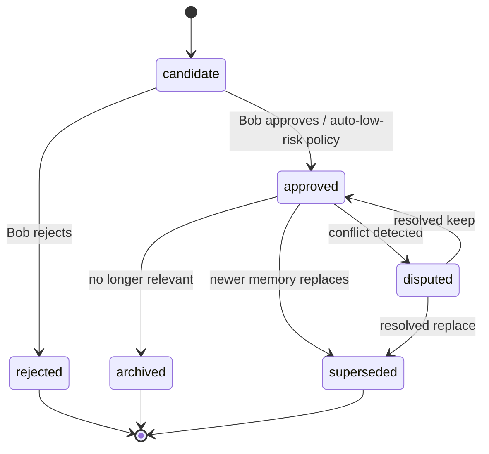

# Hibob ERD & Data Model

Status: Draft matang v0.1

## 1. Data model principles

1. **Relational DB adalah source of truth.**
2. **Qdrant menyimpan vector index, bukan kebenaran final.**
3. **Memory harus punya lifecycle.**
4. **Semua tool/action harus bisa diaudit.**
5. **Setiap jawaban penting harus bisa dilacak ke conversation, memory, document, tool run, dan trace.**

## 2. Entity groups

### Identity & user

- `users`
- `personas`
- `persona_rules`

### Conversation

- `conversations`
- `messages`
- `session_summaries`

### Memory

- `memories`
- `memory_embeddings`
- `memory_sources`
- `memory_conflicts`
- `memory_reviews`

### Knowledge

- `documents`
- `document_chunks`
- `document_embeddings`
- `web_sources`
- `ingestion_jobs`

### Model & agent

- `model_providers`
- `model_runs`
- `agent_runs`
- `agent_steps`

### Tools

- `tools`
- `tool_runs`
- `tool_permissions`
- `approval_requests`

### Evaluation & observability

- `eval_suites`
- `eval_cases`
- `eval_runs`
- `eval_results`
- `trace_links`

### Governance

- `audit_logs`
- `policy_versions`
- `policy_rules`
- `adr_records`

### Memory graph & calibration (ADR 0006, ADR 0007)

- `memory_edges`
- `memory_usage_feedback`

### Policy engine & trust (ADR 0005)

- `policy_rules`
- `tool_trust_scores`
- `content_provenance_flags`

### Replay & adversarial evaluation (ADR 0008, ADR 0009)

- `replay_runs`
- `redteam_attempts`
- `eval_judge_versions`

### Reflection & sandbox (ADR 0010, ADR 0011)

- `reflections`
- `sandbox_runs`

### Router economics (ADR 0012)

- `budget_ceilings`
- `cost_ledger`
- `router_policy_feedback`

## 3. Mermaid ERD

```mermaid
erDiagram
    users ||--o{ conversations : owns
    users ||--o{ memories : owns
    users ||--o{ documents : owns
    users ||--o{ approval_requests : approves

    personas ||--o{ persona_rules : has
    users ||--o{ personas : uses

    conversations ||--o{ messages : contains
    conversations ||--o{ session_summaries : summarized_by
    messages ||--o{ memory_sources : source_of
    session_summaries ||--o{ memory_sources : source_of

    memories ||--o{ memory_sources : has
    memories ||--o{ memory_conflicts : left_memory
    memories ||--o{ memory_conflicts : right_memory
    memories ||--o{ memory_reviews : reviewed_by
    memories ||--o{ memory_embeddings : indexed_by

    documents ||--o{ document_chunks : split_into
    documents ||--o{ ingestion_jobs : processed_by
    document_chunks ||--o{ document_embeddings : indexed_by
    web_sources ||--o{ documents : creates

    conversations ||--o{ agent_runs : triggers
    agent_runs ||--o{ agent_steps : contains
    agent_runs ||--o{ model_runs : uses
    agent_steps ||--o{ tool_runs : may_call

    tools ||--o{ tool_runs : executes
    tools ||--o{ tool_permissions : governed_by
    tool_runs ||--o{ approval_requests : may_require
    approval_requests ||--o{ audit_logs : logged_as

    eval_suites ||--o{ eval_cases : contains
    eval_suites ||--o{ eval_runs : runs
    eval_runs ||--o{ eval_results : produces
    agent_runs ||--o{ trace_links : traced_by
    model_runs ||--o{ trace_links : traced_by
    tool_runs ||--o{ trace_links : traced_by

    policy_versions ||--o{ tool_permissions : defines
    policy_versions ||--o{ audit_logs : referenced_by

    memories ||--o{ memory_edges : from_node
    memories ||--o{ memory_edges : to_node
    memories ||--o{ memory_usage_feedback : generates

    policy_versions ||--o{ policy_rules : contains
    tools ||--o{ tool_trust_scores : earns
    tools ||--o{ sandbox_runs : isolated_via
    tool_runs ||--o{ sandbox_runs : executed_in

    model_runs ||--o{ replay_runs : replayed_as
    eval_cases ||--o{ redteam_attempts : converted_from
    eval_runs ||--o{ eval_judge_versions : scored_by

    users ||--o{ reflections : receives
    users ||--o{ budget_ceilings : sets
    model_runs ||--o{ cost_ledger : debits
    budget_ceilings ||--o{ cost_ledger : constrains
```



See section 10 for the v0.2 entities introduced by ADR 0005-0012 (`memory_edges`, `memory_usage_feedback`, `policy_rules`, `tool_trust_scores`, `content_provenance_flags`, `replay_runs`, `redteam_attempts`, `eval_judge_versions`, `reflections`, `sandbox_runs`, `budget_ceilings`, `cost_ledger`, `router_policy_feedback`).

## 4. Core tables

### users

Menyimpan identitas pemilik/user.

Kolom penting:

- `id`
- `display_name`
- `timezone`
- `default_privacy_tier`
- `created_at`

### conversations

Menyimpan sesi percakapan.

Kolom penting:

- `id`
- `user_id`
- `title`
- `conversation_type`: chat, blueprint, debug, eval, coding, research
- `status`: active, archived
- `created_at`
- `updated_at`

### messages

Kolom penting:

- `id`
- `conversation_id`
- `role`: user, assistant, system, tool
- `content`
- `content_type`: text, markdown, json, file_ref
- `model_run_id`
- `trace_id`
- `created_at`

### session_summaries

Kolom penting:

- `id`
- `conversation_id`
- `summary`
- `decisions_json`
- `assumptions_json`
- `risks_json`
- `open_questions_json`
- `memory_candidates_json`
- `created_at`

### memories

Kolom penting:

- `id`
- `user_id`
- `memory_type`: profile, preference, project, decision, principle, correction, warning, relationship, task, system_identity
- `scope`: bob, hibob, project, global
- `title`
- `content`
- `status`: candidate, approved, rejected, archived, superseded
- `confidence`: 0.0-1.0
- `sensitivity`: public, internal, private, secret
- `stability`: temporary, session, medium, durable
- `valid_from`
- `valid_until`
- `superseded_by_memory_id`
- `created_at`
- `updated_at`

### memory_sources

Menghubungkan memory dengan bukti.

Kolom:

- `id`
- `memory_id`
- `source_type`: message, session_summary, document, manual
- `source_id`
- `quote_or_excerpt`
- `created_at`

### memory_conflicts

Kolom:

- `id`
- `memory_id_a`
- `memory_id_b`
- `conflict_type`: contradiction, outdated, ambiguity, duplicate
- `severity`: low, medium, high
- `status`: open, resolved, ignored
- `resolution_note`
- `created_at`

### documents

Kolom:

- `id`
- `user_id`
- `title`
- `source_type`: upload, web, repo, note
- `source_uri`
- `file_hash`
- `privacy_tier`
- `status`: pending, parsed, indexed, failed, archived
- `metadata_json`
- `created_at`

### document_chunks

Kolom:

- `id`
- `document_id`
- `chunk_index`
- `content`
- `token_count`
- `metadata_json`
- `created_at`

### tools

Kolom:

- `id`
- `name`
- `description`
- `tool_type`: internal, mcp, workflow, browser, code, db, filesystem
- `input_schema_json`
- `output_schema_json`
- `risk_level`: low, medium, high, critical
- `default_permission`: auto, ask, deny
- `enabled`
- `created_at`

### tool_runs

Kolom:

- `id`
- `tool_id`
- `agent_run_id`
- `requested_by`: user, agent, system
- `input_json`
- `output_json`
- `status`: requested, approved, running, succeeded, failed, denied
- `risk_level_at_run`
- `approval_request_id`
- `trace_id`
- `started_at`
- `finished_at`

### approval_requests

Kolom:

- `id`
- `user_id`
- `request_type`: tool_run, memory_write, document_export, cloud_context, file_update
- `summary`
- `payload_json`
- `status`: pending, approved, rejected, expired
- `expires_at`
- `decided_at`

### audit_logs

Kolom:

- `id`
- `actor_type`: user, assistant, system, tool
- `actor_id`
- `event_type`
- `target_type`
- `target_id`
- `metadata_json`
- `created_at`

## 5. Vector collections in Qdrant

### `hibob_memories`

Payload:

```json
{
  "memory_id": "uuid",
  "user_id": "uuid",
  "memory_type": "decision",
  "scope": "project",
  "status": "approved",
  "sensitivity": "internal",
  "confidence": 0.86,
  "created_at": "2026-06-23T00:00:00Z"
}
```

### `hibob_document_chunks`

Payload:

```json
{
  "chunk_id": "uuid",
  "document_id": "uuid",
  "source_type": "web",
  "source_uri": "https://example.com/docs",
  "privacy_tier": "internal",
  "chunk_index": 12
}
```

### `hibob_code_chunks` future

Untuk repo/code semantic search.

## 6. Memory status lifecycle



## 7. Data retention defaults

| Data | Default retention | Notes |
|---|---:|---|
| Raw messages | indefinite local | Bob can purge |
| Session summaries | indefinite | compact long-term context |
| Candidate memories rejected | 30-90 days | for audit/debug |
| Approved memories | indefinite until archived | source linked |
| Tool runs | indefinite local | high value audit |
| Phoenix traces | configurable | avoid leaking secrets |
| Eval results | indefinite | useful regression history |
| Raw uploaded files | user-controlled | can keep hash only |
| Memory edges | indefinite until memory archived | graph history matters for provenance |
| Memory usage feedback | 180 days rolling | enough to drive calibration without unbounded growth |
| Redteam attempts | indefinite | converted ones become permanent eval cases |
| Replay runs | indefinite | evidence trail for model migration ADRs |
| Reflections | 90 days unless acted on | acted-on reflections live on via the memory/blueprint candidate they created |
| Sandbox runs | indefinite local | audit trail for high-risk tool execution |
| Cost ledger | indefinite | financial audit trail |

## 8. Migration rules

- Every schema change must have migration file.
- Every memory schema change must include backfill plan.
- Every embedding model change must create new vector namespace or versioned collection.
- Never overwrite old embeddings without migration audit.
- Keep `embedding_model`, `embedding_dim`, and `embedding_version` in metadata.

## 9. v0.2 additions (ADR 0005-0012)

### memory_edges (ADR 0006)

Typed, directed relations between memories: `supersedes`, `contradicts`, `depends_on`, `supports`, `derived_from`. `discovered_at` is the edge's own timestamp, distinct from the connected memories' `valid_from/valid_until` (world time) and `created_at` (system time) - this is what makes the memory graph bi-temporal. `memory_conflicts` becomes a specialization of this graph (conflict-type edges) rather than a separate mechanism.

### memory_usage_feedback (ADR 0007)

One row per retrieval-and-use or correction event for a memory. Drives the Beta-distribution confidence update described in doc 04 (Memory Confidence Calibration). Never writes to `memories.status` directly - only influences `confidence` and retrieval ranking.

### policy_rules / tool_trust_scores / content_provenance_flags (ADR 0005)

`policy_rules` are the executable conditions the Tool Gateway evaluates (allow/ask/deny) per `policy_version`. `tool_trust_scores` accumulate per `(tool, context)` from clean audited runs and gate the ask-to-auto escalation, capped by `risk_level`. `content_provenance_flags` tag retrieved content (`system|user|policy|retrieved_data|tool_output`) and record injection-classifier scores before any resulting tool call executes.

### replay_runs (ADR 0008)

One row per replay of a historical `model_run` against a candidate provider/model. `assembled_input_ref` points to the redacted, fully-assembled prompt context (not just the output hash) so replay is genuinely deterministic. `decision` (adopt/reject/inconclusive) must be cited by any model-migration ADR.

### redteam_attempts / eval_judge_versions (ADR 0009)

`redteam_attempts` log every adversarial probe the Security Skeptic Agent generates against a sandboxed Hibob instance; successful attempts link to a newly created `eval_cases` row via `converted_to_eval_case_id`, making security regressions self-accumulating. `eval_judge_versions` pins which judge model/version graded a given `eval_run` and its agreement score against the golden dataset, so judge drift is visible instead of silent.

### reflections (ADR 0010)

Output of the scheduled reflection job: conflict scans, untested assumptions with dependents, stale RAG sources. Strictly read-only in origin - `proposed_candidate_ids` only ever points into the existing memory-candidate/blueprint-update approval pipeline, never writes durable state directly.

### sandbox_runs (ADR 0011)

One row per ephemeral container execution backing a high-risk `tool_run` (shell, browser, third-party MCP). `network_mode` defaults to `none` and `filesystem_mode` defaults to `read_only`; any deviation must be an explicit allowlist entry on the tool definition, not an ambient default.

### budget_ceilings / cost_ledger / router_policy_feedback (ADR 0012)

`budget_ceilings` define hard daily/session spend limits; `cost_ledger` debits every cloud `model_run` against the active ceiling and flags `ceiling_breached` to trigger an approval pause. `router_policy_feedback` aggregates eval score, latency, and cost per `(task_type, provider, model)` to bias the Model Router's bounded bandit selection - it never expands which models are eligible for a task, only biases the choice among models the static routing table (doc 12 section 4) already allows.

## 10. Data model anti-patterns

Do not:

- store memory only as vector chunks,
- overwrite memory without source trace,
- mix Bob memory and Hibob system memory without scope,
- store secrets in traces,
- let tools write directly to DB without service layer,
- use one `metadata` blob for everything without indexed fields.
