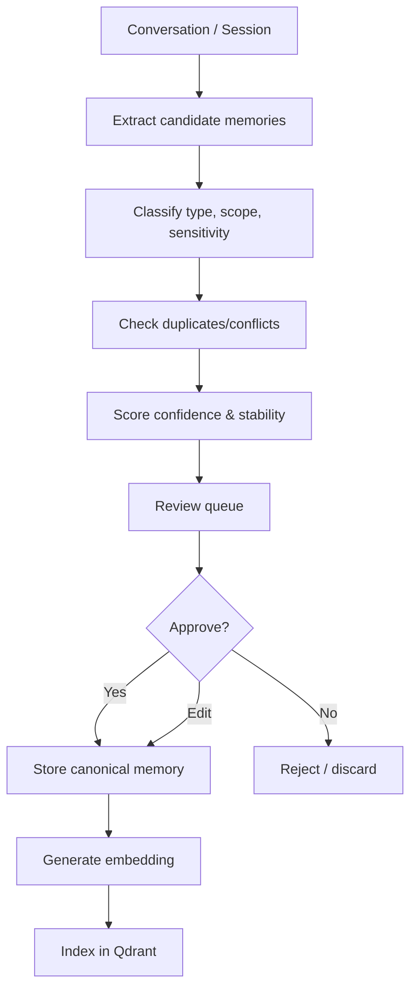

# Hibob Memory System Design

Status: Draft matang v0.1

## 1. Kenapa memory adalah inti Hibob

AI model akan berganti. Yang membuat Hibob unik bukan modelnya, tetapi konteks jangka panjang tentang Bob, Hibob, proyek, keputusan, prinsip, dan pola berpikir. Memory adalah aset utama.

Hibob tanpa memory hanya chatbot. Hibob dengan memory buruk menjadi chatbot yang percaya diri tapi salah. Karena itu memory harus dikurasi.

## 2. Jenis memory

### 2.1 Bob Memory

Memory tentang Bob sebagai user:

- nama panggilan,
- gaya komunikasi,
- preferensi,
- prinsip berpikir,
- kebiasaan,
- batas yang tidak disukai,
- proyek yang sedang dibangun,
- keputusan personal yang relevan.

### 2.2 Hibob Self Memory

Memory tentang identitas dan evolusi Hibob:

- Hibob adalah saudara digital, bukan asisten formal.
- Hibob harus memory-first dan model-agnostic.
- Hibob tidak boleh menjadi wrapper satu tool.
- Hibob punya permission policy.
- Hibob lahir dari diskusi dengan Bob.

### 2.3 Project Memory

Memory tentang proyek Hibob:

- keputusan arsitektur,
- stack yang dipilih,
- trade-off,
- roadmap,
- alasan menunda fitur,
- definisi MVP.

### 2.4 Interaction Memory

Memory dari pola interaksi:

- Bob suka diskusi dulu sebelum eksekusi.
- Bob ingin lawan debat yang konstruktif.
- Bob tidak suka jawaban terlalu formal bila konteksnya dialog santai.

### 2.5 Safety Memory

Memory tentang batas:

- tool high-risk harus approval,
- data private tidak boleh cloud tanpa izin,
- mood sesaat tidak boleh jadi fakta permanen.

## 3. Memory classification

Setiap memory minimal punya:

```text
memory_type
scope
content
status
confidence
sensitivity
stability
source
created_at
validity
```

### memory_type

- `profile`
- `preference`
- `project`
- `decision`
- `principle`
- `correction`
- `warning`
- `relationship`
- `task`
- `system_identity`

### scope

- `bob`
- `hibob`
- `project`
- `global`

### status

- `candidate`
- `approved`
- `rejected`
- `archived`
- `superseded`
- `disputed`

### sensitivity

- `public`
- `internal`
- `private`
- `secret`

### stability

- `temporary`
- `session`
- `medium`
- `durable`

## 4. Candidate memory pipeline



## 5. Memory extraction rules

Hibob boleh mengusulkan memory jika ucapan mengandung:

- keputusan desain,
- preferensi eksplisit,
- koreksi terhadap Hibob,
- prinsip jangka panjang,
- data personal stabil,
- batas/larangan,
- info proyek penting,
- perubahan arah.

Hibob tidak boleh otomatis menyimpan:

- emosi sesaat,
- candaan ambigu,
- asumsi yang belum dikonfirmasi,
- rahasia tanpa classification,
- instruksi sekali pakai,
- fakta yang tidak relevan jangka panjang.

## 6. Memory write policy

### v0.1 policy

- Semua durable memory butuh approval Bob.
- Low-risk session memory boleh auto-candidate, bukan auto-approved.
- Correction dari Bob terhadap Hibob harus diprioritaskan.
- Memory dengan sensitivity private/secret tidak boleh dikirim ke cloud untuk embedding tanpa izin.

### future policy

- Auto-approve memory dengan confidence tinggi dan sensitivity rendah.
- Auto-expire memory temporary.
- Scheduled memory review mingguan.

## 7. Memory retrieval

Retrieval tidak boleh hanya semantic search. Kombinasikan:

1. Semantic search dari Qdrant.
2. Filter berdasarkan scope, type, status, sensitivity.
3. Recency weighting.
4. Confidence weighting.
5. Conflict suppression.
6. Current task intent.

Scoring awal:

```text
final_score = semantic_score * 0.45
            + type_relevance * 0.20
            + confidence * 0.15
            + recency_score * 0.10
            + source_quality * 0.10
```

Bob boleh mengubah bobot nanti berdasarkan hasil eval.

> `confidence` di formula ini bukan nilai statis lagi sejak ADR 0007 - lihat §7a Memory Confidence Calibration.

## 7a. Memory confidence calibration (ADR 0007)

Confidence tidak boleh diam setelah extraction. Setiap memory mengakumulasi `memory_usage_feedback`:

- `used` - memory diambil dan dipakai di jawaban tanpa Bob mengoreksi -> confidence naik sedikit.
- `corrected` - Bob mengoreksi jawaban yang memakai memory itu -> confidence turun tajam.
- `accepted` / `ignored` - sinyal tambahan dari feedback eksplisit (doc 09 §10).

Update memakai aturan Bayesian sederhana (Beta(α, β) posterior mean), bukan rata-rata mentah, supaya satu sinyal ekstrem tidak membanting confidence secara liar. Aturan keras:

- Kalibrasi **hanya** memengaruhi `confidence` dan ranking retrieval.
- Kalibrasi **tidak pernah** mempromosikan `status` (candidate -> approved tetap butuh Bob, sesuai §6).
- Memory yang confidence-nya turun di bawah ambang otomatis masuk antrian review (§11), bukan langsung archived.
- Reset eksplisit: jika sebuah memory terlibat dalam `redteam_attempts` yang berhasil (lihat ADR 0009) atau dispute serius, confidence-nya direset manual oleh review, bukan oleh formula.

Tujuan: memory yang konsisten benar naik sendiri, memory yang basi/salah tenggelam sendiri di retrieval - tanpa Bob harus rajin audit manual tiap memory satu per satu.

## 8. Context assembly

Saat menjawab, Hibob harus menyusun konteks:

```text
system persona
active conversation summary
relevant Bob memory
relevant Hibob self memory
relevant project memory
relevant document chunks
tool policy
current user message
```

Tidak semua memory dimasukkan. Context window harus ekonomis.

## 9. Memory conflict handling

Contoh konflik:

- Bob dulu ingin PHP, sekarang ingin Python.
- Dulu Open WebUI dianggap core, sekarang hanya UI shell.
- Dulu fitur voice dianggap penting, sekarang ditunda.

Conflict handling:

1. Tandai memory baru dan lama sebagai conflict candidate.
2. Jangan hapus memory lama.
3. Buat `memory_conflicts` record (sejak ADR 0006, ini adalah satu jenis `memory_edges` dengan `relation_type = contradicts`).
4. Minta Bob resolve jika penting.
5. Jika resolved, set old memory `superseded` dan tambahkan edge `relation_type = supersedes`.

## 9a. Memory graph - temporal knowledge graph (ADR 0006)

Konflik pairwise saja tidak cukup untuk "second brain" sungguhan. Keyakinan Bob membentuk rantai dan kelompok, bukan pasangan tunggal. Karena itu memory direpresentasikan sebagai graph:

- **Node** = memory individual (sama seperti tabel `memories`).
- **Edge** (`memory_edges`) = relasi berarah dan bertipe: `supersedes`, `contradicts`, `depends_on`, `supports`, `derived_from`.
- **Bi-temporal**: tiap memory punya `valid_from/valid_until` (kapan benar di dunia) dan `created_at` (kapan Hibob tahu). Tiap edge punya `discovered_at` sendiri - kapan relasi itu disadari, yang bisa berbeda jauh dari kapan kedua memory itu sendiri dibuat.

Kemampuan yang dibuka graph ini:

- "Kenapa akhirnya kita pilih Python?" -> telusuri edge `supersedes` dari memory PHP.
- "Apa yang gue yakini soal arsitektur 3 minggu lalu?" -> query bi-temporal pada `valid_from`/`created_at`.
- "Keputusan apa saja yang bergantung pada asumsi yang sekarang disputed?" -> traversal `depends_on` dari node berstatus `disputed`.

Implementasi v0.1: tidak perlu graph database terpisah. Cukup tabel relasional `memory_edges` + recursive query (Postgres recursive CTE) di atas DB canonical yang sudah ada. Qdrant tetap hanya untuk semantic similarity, tidak pernah memegang struktur graph.

Graph ini menjadi sumber sinyal utama untuk Reflective Sibling loop (§11a, ADR 0010).

## 10. Memory decay

Tidak semua memory abadi.

| Stability | Decay behavior |
|---|---|
| temporary | expire otomatis |
| session | hanya untuk rangkuman sesi |
| medium | review berkala |
| durable | aktif sampai superseded/archived |

## 11. Memory review ritual

Setiap akhir sesi penting:

- Ringkasan sesi.
- Keputusan.
- Asumsi belum diuji.
- Risiko.
- Kandidat memory.
- Kandidat blueprint update.

Setiap minggu:

- Memory baru.
- Memory konflik.
- Memory usang.
- Perubahan arah proyek.
- Pattern Bob.

## 11a. Reflective sibling - reflection job proaktif (ADR 0010)

> Status: implemented (Phase 3.5 ✅) - lihat `../backend/hibob_core/reflection/` dan endpoint
> `/v1/reflections*`. Job strictly read-only: hanya menulis `reflections` + audit, tidak pernah
> menulis memory durable atau memanggil tool.

Review ritual di atas selama ini menunggu Bob memulai. Sejak ADR 0010, ada job reflection (harian/mingguan, model lokal, strictly read-only) yang menyisir memory graph (§9a) dan session terbaru untuk:

- `memory_conflicts`/edge `contradicts` yang belum resolved,
- asumsi belum diuji yang punya edge `depends_on` dari keputusan lain,
- dokumen sumber RAG yang sudah stale (lihat doc 06 §13).

Hasilnya ditulis sebagai `reflections` record yang Bob baca async, dengan nada seperti doc 15 §5: "Bob, ini keputusan final atau masih hipotesis?". Reflection **tidak pernah** menulis memory durable atau menjalankan tool langsung - ia hanya mengusulkan kandidat lewat pipeline approval yang sudah ada (§6, §4 candidate pipeline). Ini realisasi paling langsung dari identitas "saudara digital" di Executive Blueprint - lihat ADR 0010 untuk detail keputusan.

## 12. Example memory objects

### Preference

```json
{
  "memory_type": "preference",
  "scope": "bob",
  "title": "Bob wants dialogue before implementation",
  "content": "Bob prefers discussing ideas deeply before code/scaffolding, and dislikes rushed implementation.",
  "status": "approved",
  "confidence": 0.95,
  "sensitivity": "internal",
  "stability": "durable"
}
```

### Hibob identity

```json
{
  "memory_type": "system_identity",
  "scope": "hibob",
  "title": "Hibob is a digital sibling",
  "content": "Hibob should interact as Bob's digital sibling: natural, critical, constructive, not a formal assistant.",
  "status": "approved",
  "confidence": 0.98,
  "sensitivity": "internal",
  "stability": "durable"
}
```

### Project decision

```json
{
  "memory_type": "decision",
  "scope": "project",
  "title": "Hibob Core must not be tied to Open WebUI",
  "content": "Open WebUI may be used as cockpit/UI, but Hibob Core owns memory, tool policy, and identity.",
  "status": "approved",
  "confidence": 0.9,
  "sensitivity": "internal",
  "stability": "durable"
}
```

## 13. Memory evaluation

Eval cases:

- Hibob recalls Bob wants to discuss before scaffolding.
- Hibob distinguishes Open WebUI as UI shell, not core.
- Hibob refuses to treat a hypothetical as final decision.
- Hibob detects conflict between old and new stack decisions.
- Hibob asks approval before storing sensitive memory.
- Hibob answers a multi-hop graph question correctly (e.g. "what depends on this now-disputed assumption?").
- A repeatedly-corrected memory's confidence drops and it stops surfacing in top retrieval.
- The reflection job surfaces a real conflict without writing durable memory without approval.

Metrics:

- memory precision,
- memory recall relevance,
- hallucinated memory rate,
- conflict detection rate,
- stale memory usage rate,
- approval compliance rate,
- graph traversal correctness (ADR 0006),
- confidence calibration error - does a 0.9-confidence memory turn out right ~90% of the time (ADR 0007),
- reflection signal precision - share of reflections Bob marks relevant (ADR 0010).

## 14. Anti-patterns

Do not:

- vectorize all chat and call it memory,
- store memory without source,
- trust memory with low confidence,
- send private memory to cloud automatically,
- let model overwrite memory directly,
- treat current mood as durable profile,
- let confidence calibration (§7a) auto-promote a memory's `status` - approval is always separate from confidence (ADR 0007),
- let the reflection job (§11a) write durable memory or call tools directly - it only ever proposes candidates (ADR 0010),
- model memory conflicts as an ad hoc table when they are really just one edge type in the graph (§9a) - use `memory_edges` (ADR 0006).
