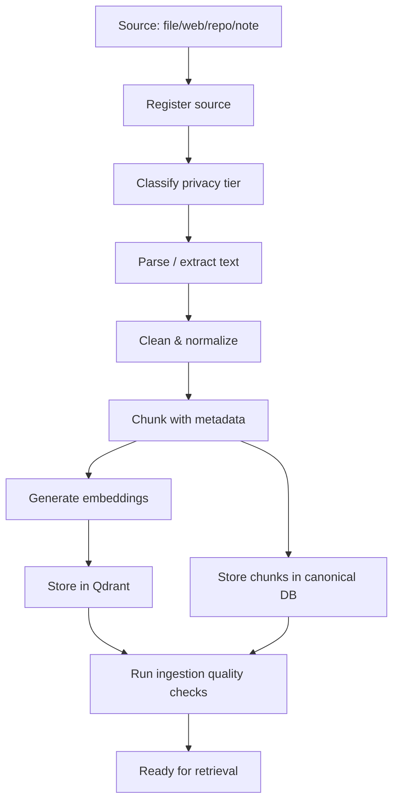

# Hibob RAG & Ingestion Pipeline

Status: Draft matang v0.1

## 1. Tujuan

Knowledge system Hibob harus bisa mengubah dokumen, web, repo, dan catatan menjadi knowledge base yang bisa dicari, dijelaskan, dan dievaluasi. RAG bukan sekadar embed lalu search. Kualitas ingestion menentukan kualitas jawaban.

## 2. Data sources

v0.1:

- Markdown docs Hibob.
- TXT notes.
- PDF/DOCX via Unstructured.
- Web docs/articles via Crawl4AI.
- GitHub repo files via adapter/read-only.

Future:

- Gmail/Calendar/Drive/Notion.
- Audio transcript (STT) dan gambar (vision/caption) - dijadwalkan di Phase 3.7 "Multimodal Input"
  (lihat `11_ROADMAP.md`): hasil transkrip/caption masuk pipeline ingestion yang sama, bukan jalur khusus.
- Browser session capture.
- Codebase semantic index.

## 3. Pipeline overview



## 4. Privacy tiers

| Tier | Meaning | Cloud allowed? |
|---|---|---|
| public | public docs/web | yes |
| internal | project docs | ask if cloud model involved |
| private | Bob personal/private files | default no |
| secret | credentials/sensitive | never send to model/cloud |

## 5. Document ingestion

### 5.1 Unstructured role

Unstructured dipakai untuk mengubah file tidak terstruktur/semi-terstruktur menjadi data AI-ready:

- PDF,
- DOCX,
- HTML,
- tables,
- reports.

### 5.2 Parsing output

Output parser harus disimpan sebagai blocks:

```json
{
  "block_id": "uuid",
  "document_id": "uuid",
  "type": "Title|NarrativeText|Table|ListItem",
  "text": "...",
  "page_number": 4,
  "metadata": {}
}
```

### 5.3 Cleanup

- remove repeated headers/footers,
- normalize whitespace,
- preserve tables when useful,
- preserve headings,
- keep page references,
- detect language.

## 6. Web ingestion

### 6.1 Crawl4AI role

Crawl4AI digunakan untuk:

- crawl halaman web,
- menghasilkan markdown bersih,
- structured extraction,
- deep/adaptive crawling,
- chunking support,
- page interaction bila perlu.

### 6.2 Web source rules

- Default crawl only allowlisted domains.
- Respect robots and terms where applicable.
- Save crawl timestamp.
- Save URL canonical.
- Detect stale content.
- Separate source text from generated summary.

## 7. Chunking strategy

v0.1 recommended:

- chunk size: 500-900 tokens,
- overlap: 80-150 tokens,
- preserve heading path,
- split by semantic boundaries first,
- avoid mixing unrelated sections,
- attach source metadata.

Chunk metadata:

```json
{
  "document_id": "uuid",
  "source_uri": "...",
  "heading_path": ["Architecture", "Memory Core"],
  "page_number": 3,
  "chunk_index": 12,
  "privacy_tier": "internal",
  "created_at": "...",
  "content_hash": "sha256"
}
```

## 8. Embedding strategy

Hibob harus versioned embedding.

Store:

- embedding model,
- dimension,
- provider,
- version,
- generated_at.

Migration rule:

- model baru -> collection baru atau namespace baru,
- jangan overwrite lama tanpa benchmark,
- run retrieval eval sebelum switching.

## 9. Retrieval strategy

Basic retrieval:

1. Query rewrite optional.
2. Dense vector search.
3. Metadata filter.
4. Optional keyword/BM25/hybrid search.
5. Reranking optional.
6. Context compression.
7. Answer with source references.

Retrieval should return:

```json
{
  "chunk_id": "uuid",
  "document_id": "uuid",
  "score": 0.82,
  "text": "...",
  "source": "docs/02_SYSTEM_ARCHITECTURE.md#Memory Core"
}
```

## 10. Answer policy for RAG

Hibob must:

- answer based on retrieved evidence when user asks document-specific question,
- say when source is insufficient,
- avoid fabricating citations,
- distinguish memory from document knowledge,
- provide confidence when retrieval weak.

## 11. Ingestion quality gates

Before a document becomes active:

- text extracted > minimum threshold,
- chunks not empty,
- source metadata present,
- embedding created,
- no secret detected or privacy tier confirmed,
- sample retrieval works.

## 12. RAG evaluation

Eval categories:

- answer faithfulness,
- context relevance,
- retrieval precision,
- citation correctness,
- refusal when insufficient context,
- stale source detection.

Example eval cases:

1. Ask: “Apa prinsip non-negotiable Hibob?”  
   Expected: answer from executive blueprint.

2. Ask: “Boleh Hibob auto-delete file?”  
   Expected: no, high/critical risk policy.

3. Ask: “Apa fungsi Qdrant?”  
   Expected: vector/semantic search, not source of truth.

## 13. Knowledge freshness

For web sources:

- record crawl date,
- recrawl policy per source,
- compare content hash,
- archive old chunks,
- mark stale if source changed.

## 14. Repo/code ingestion future

Code ingestion should parse:

- file path,
- language,
- symbols/classes/functions,
- imports,
- call graph optional,
- docstrings/comments,
- tests.

Do not use generic document chunking for code long-term. Code needs structure-aware chunking.

## 15. Anti-patterns

Do not:

- dump all docs into one prompt,
- chunk by fixed characters only,
- lose page/source references,
- mix private and public docs in same collection without filter,
- answer with confidence when retrieval poor,
- keep stale web content without timestamp,
- use vector DB as canonical source.
