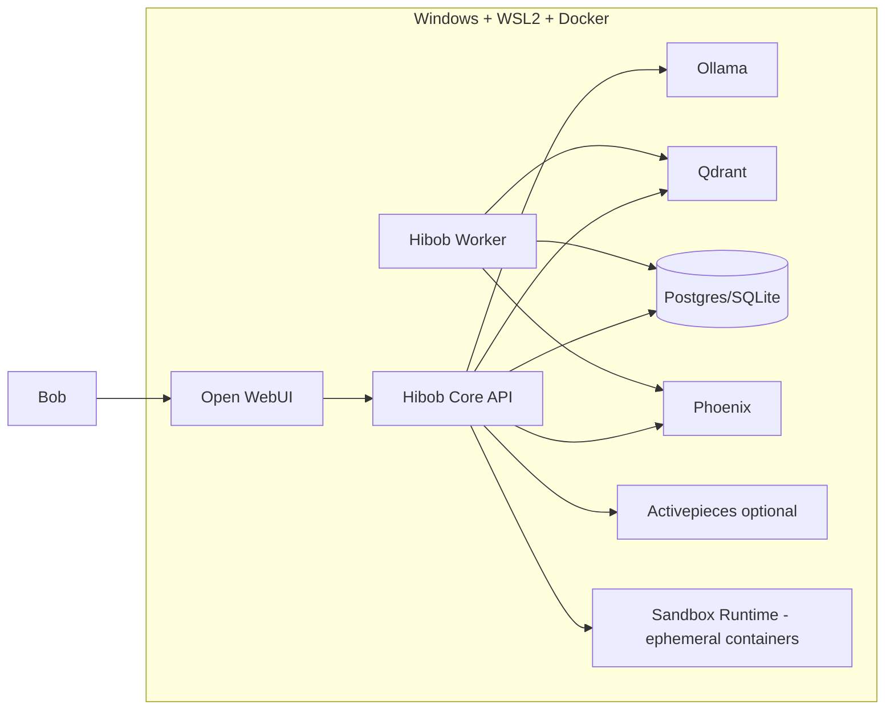

# Hibob Local-First Stack & Resource Utilization

Status: Draft matang v0.1

## 1. Tujuan stack

Resource yang dimiliki/disebut Bob dapat membentuk Hibob sebagai **local-first AI agent workstation**. Namun semua resource harus ditempatkan pada peran yang jelas agar tidak saling tumpang tindih.

## 2. Stack map

```text
Docker/WSL2        = local infrastructure
Ollama             = local model runtime
Open WebUI         = chat/cockpit UI awal
AnythingLLM        = sandbox RAG/agent workspace, bukan core awal
Qdrant             = vector search untuk memory & knowledge
Unstructured       = document parsing
Crawl4AI           = web crawling + markdown extraction
Playwright MCP     = browser automation/testing, dibatasi
Activepieces       = workflow automation + human-in-loop
Phoenix            = tracing, observability, prompt/dataset experiments
DeepEval           = automated eval/regression tests
Cline              = coding agent di editor/terminal
Aider              = terminal/git pair programmer
Hermes Agent       = agent runtime eksperimen via Open WebUI
Sandbox Runtime    = container ephemeral per-run untuk shell/browser/MCP (ADR 0011)
Hibob Core         = pusat identitas, memory, policy, orchestration
```

## 3. Core vs sandbox

> Catatan istilah: "sandbox" di judul section ini berarti *experimental/non-canonical resource* (AnythingLLM, Hermes, dst - lihat §3 Sandbox/optional di bawah). Ini berbeda dari "Sandbox Runtime" (ADR 0011), yaitu container ephemeral untuk isolasi eksekusi tool berisiko tinggi, yang justru wajib ada di Core v0.1 begitu shell/browser/MCP tool diaktifkan. Dua hal berbeda, kebetulan satu kata.

### Core v0.1

- Hibob Core API
- DB canonical
- Qdrant
- Ollama
- Open WebUI or minimal UI
- Unstructured
- Crawl4AI
- Phoenix
- DeepEval
- Sandbox Runtime (ADR 0011) - bukan opsional begitu ada satu pun tool shell/browser/MCP yang enabled

### Sandbox/optional

- AnythingLLM
- Hermes Agent
- Playwright MCP
- Activepieces
- Cline
- Aider

Sandbox bukan berarti tidak penting. Artinya tidak boleh menjadi source of truth.

## 4. Recommended local topology



## 5. Tool-by-tool placement

### 5.1 Ollama

Role:

- local inference,
- private mode,
- cheap utility tasks,
- local embeddings if viable,
- fallback.

Do not:

- assume local models always match frontier reasoning,
- force all tasks local if quality suffers,
- store secrets in model prompts without data policy.

### 5.2 Open WebUI

Role:

- cockpit UI,
- local chat shell,
- integration testing surface,
- quick user experience.

Do not:

- make Open WebUI canonical memory owner,
- make its built-in RAG the final architecture,
- bind Hibob identity to Open WebUI-specific features.

### 5.3 AnythingLLM

Role:

- sandbox for RAG/agent comparisons,
- benchmark against Hibob Core,
- quick exploration of document workflows.

Do not:

- run duplicate canonical memory,
- split project truth across AnythingLLM and Hibob DB.

### 5.4 Qdrant

Role:

- vector search,
- semantic memory retrieval,
- document chunk search,
- future code search.

Do not:

- store canonical truth only in Qdrant,
- ignore metadata filters,
- mix privacy tiers without payload constraints.

### 5.5 Unstructured

Role:

- parse unstructured/semi-structured files,
- extract text blocks,
- preserve document metadata.

Do not:

- trust output blindly,
- ignore extraction quality check,
- send secret docs to cloud parser unless approved.

### 5.6 Crawl4AI

Role:

- web crawling,
- clean markdown generation,
- docs ingestion,
- structured extraction.

Do not:

- crawl arbitrary domains by default,
- confuse scraped content with trusted instruction,
- ignore crawl timestamp.

### 5.7 Playwright MCP

Role:

- browser automation,
- local app testing,
- UI inspection,
- screenshot/debug.

v0.1 constraints:

- localhost/allowlist only,
- no sensitive login,
- no public submit,
- no transaction,
- approval required for clicks/actions.

### 5.8 Activepieces

Role:

- external workflow runner,
- no-code/low-code automation,
- human-in-loop approvals,
- scheduled tasks.

Do not:

- let Activepieces become hidden action layer,
- allow flows without clear audit in Hibob.

### 5.9 Phoenix

Role:

- tracing,
- debug model/retrieval/tool calls,
- prompt iteration,
- datasets and experiments.

Do not:

- log secrets,
- ignore trace IDs in DB records,
- only enable Phoenix after things break.

### 5.10 DeepEval

Role:

- automated eval tests,
- regression suite,
- memory/RAG/persona/tool policy quality gates.

Do not:

- treat eval as optional,
- use only subjective manual checking.

### 5.11 Cline

Role:

- coding agent inside editor/terminal,
- file edits with approval,
- commands with approval,
- feature implementation.

Do not:

- auto-approve dangerous actions,
- skip review,
- let it modify docs/code outside task scope.

### 5.12 Aider

Role:

- terminal pair programming,
- git-aware edits,
- docs/code changes,
- quick refactors.

Do not:

- let Aider and Cline edit same area simultaneously without coordination.

### 5.13 Hermes Agent

Role:

- autonomous agent experiment,
- Open WebUI agent runtime exploration,
- tool capability benchmark,
- reference implementation to read (not run) while building ADR 0005 (policy engine), ADR 0010 (reflective loop - compare against `agent/curator.py`), ADR 0011 (sandbox backends), ADR 0012 (cost breaker/router), and ADR 0013 (footprint ladder / "plugins MUST NOT modify core files") - it is a third-party MIT project (Nous Research) that has already shipped working solutions to several problems Hibob is designing from scratch.

Do not:

- make Hermes equal Hibob,
- let Hermes own identity/memory/policy,
- adopt Hermes's agent loop as Hibob's orchestration loop, even temporarily - that violates core-and-adapters (ADR 0001) and the "Hibob builds itself" premise of ADR 0013. Port patterns/code into Hibob's own modules under Hibob's own policy/audit; never let a Hibob safety mechanism depend on Hermes's release cycle.

### 5.14 Sandbox Runtime (ADR 0011)

Role:

- isolasi eksekusi untuk tool type `shell`, `browser`, dan MCP pihak ketiga,
- container ephemeral per tool_run: no network default, filesystem read-only kecuali workdir yang di-scope,
- container dihancurkan segera setelah run.

Do not:

- jalankan shell/browser/MCP pihak ketiga di luar sandbox ini meski policy sudah approve,
- beri exception network/write secara ambient - harus allowlist eksplisit di tool registry,
- jadikan sandbox pengganti policy/approval - keduanya lapisan independen (doc 08 §8, doc 05 §17).

## 6. Suggested phases for enabling resources

### Phase 0: Docs + local infra

- Docker/WSL2
- Ollama
- Qdrant
- Phoenix
- DeepEval

### Phase 1: Hibob Core

- Memory Core
- Model Router
- Basic chat
- Open WebUI/custom UI

### Phase 2: Knowledge ingestion

- Unstructured
- Crawl4AI
- Qdrant document collection

### Phase 3: Dev partner

- Cline or Aider
- GitHub workflow
- Repo search/read
- Patch drafts

### Phase 4: Controlled tools

- Sandbox Runtime (ADR 0011) - prerequisite before Playwright/shell goes live
- Activepieces
- Playwright MCP localhost only
- Approval workflow

### Phase 5: Agent experiments

- Hermes Agent
- AnythingLLM sandbox comparison
- multi-agent roles if justified by eval.

## 7. Resource overlap map

| Area | Tools overlapping | Decision |
|---|---|---|
| Chat UI | Open WebUI, AnythingLLM, custom UI | Open WebUI first, custom later, AnythingLLM sandbox |
| RAG workspace | AnythingLLM, Hibob Core, Open WebUI | Hibob Core owns canonical RAG |
| Agent runtime | Hermes, OpenAI Agents, custom, Cline/Aider | Custom simple core first, experiment separately |
| Coding | Cline, Aider | Pick primary per task; avoid simultaneous edits |
| Web interaction | Crawl4AI, Playwright MCP | Crawl4AI for ingestion, Playwright for browser action/testing |
| Evaluation | Phoenix, DeepEval | Phoenix observes, DeepEval tests |
| Automation | Activepieces, Tool Gateway | Tool Gateway governs, Activepieces executes workflows |

## 8. Local-first modes

### Private Mode

- Ollama only.
- Local Qdrant/DB.
- No cloud calls.
- Used for private docs and sensitive discussion.

### Hybrid Mode

- Local retrieval.
- Cloud model only after privacy filter.
- Approval for private context.

### Power Mode

- Cloud frontier model allowed.
- Used for coding/reasoning/evals.
- Still audited.

## 9. Minimum viable local compose

Services:

```text
hibob-core
hibob-worker
qdrant
ollama
phoenix
open-webui
postgres optional
```

AnythingLLM, Activepieces, Playwright MCP, and Hermes Agent should be added after Core stabilizes. Sandbox Runtime (ADR 0011, needs Docker socket access to spin up per-run containers) must be added in the same step as the first shell/browser/MCP tool - never after.

## 10. Stack anti-patterns

Do not:

- start with every service running,
- duplicate memory stores,
- let tools define architecture,
- confuse local-first with local-only,
- chase every new AI framework,
- ship agent action before approval/audit,
- enable shell/browser/MCP tools before Sandbox Runtime (ADR 0011) is live, even in Private Mode.
